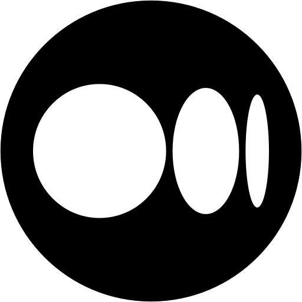

<h1 align='center'>
  Hi there 👋 I'm igor 👨‍💻
</h1>

  A JavaScript developer and inventor from Vilnius, Lithuania.

  

  📫 How to reach me: <a href='mailto:igor.kovaliov93@gmail.com'>igor.kovaliov93@gmail.com</a>

  

## Connect with me: 

[][linkedin]
[][instagram]
[][medium]
[][dev]

  

## Technical summary: 

	  
	

## Assistant tools: 

[linkedin]: https://www.linkedin.com/in/ikovaliov/
[medium]: https://medium.com/@ikovaliov/
[dev]: https://dev.to/ikovaliov
[gmail]: mailto:igor.kovaliov93@gmail.com
[instagram]: https://www.instagram.com/ikovaliov_/
